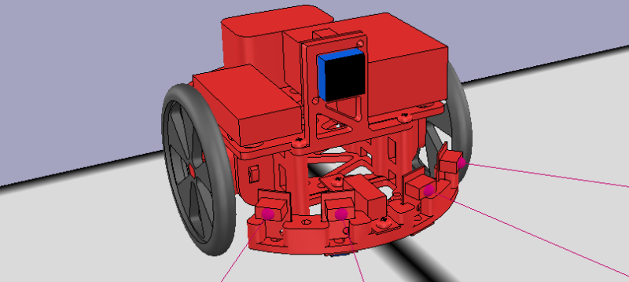
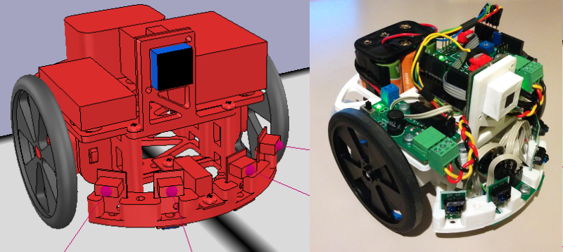
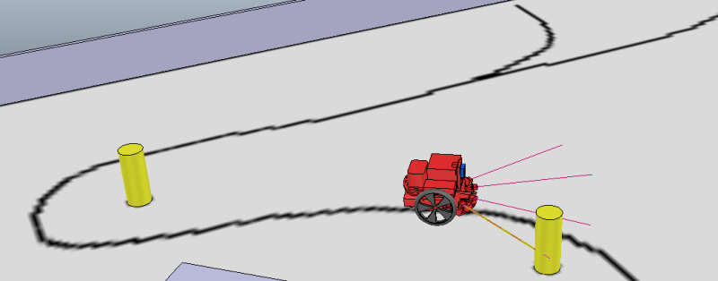

# Virtual Robot Challenge



The goal of the *Virtual Robot Challenge (VRC)* is to introduce the [Robotic Operating System (ROS)](http://www.ros.org/) and [V-REP](http://www.coppeliarobotics.com/) simulation environment by performing autonomous tasks with a simulated robot.

This is to demonstrate the advantages of development using simulation, before eventually moving on to real robots. The advantages are that the code stays the same when moving from simulation to real robot, testing in simulation is much less time consuming (avoid mechanical failures, batteries, sensors failures/calibration...), cheaper and requires less effort in general.

All software used within the scope of this project is free to use.

## Theory

ROS is composed of small stand-alone entities called *"nodes"*. Nodes publish and subscribe to messages called *"topics"* to talk between each other. One can write nodes in C++ or Python, topics are language agnostic. A good introduction can be found on the [ROS official website](http://wiki.ros.org/ROS/Introduction).

The [ROS tutorials](http://wiki.ros.org/ROS/Tutorials) are well written and straight forward, it is recommended to follow them as least for installation and workspace setup, this provides a good overview on how ROS works and how it is organized.

## Hardware

The robot has two wheels and a caster wheel in the back for locomotion. In the front it has six distance sensors, four pointing forwards and two pointing downwards under the robot, and a linear camera showing an image of 128 pixels wide and 1 pixel height.

The robot is based on the [Robopoly demonstration robot](https://github.com/Robopoly/Printed-base) and can be physically built, any type of robot can be adapted for the simulation.



## Software

The simulation is meant to be run on **Ubuntu 14.04** with **ROS Indigo**, later versions have not been tested. One can use [VirtualBox](https://www.virtualbox.org/wiki/Downloads) if such a computer is not available, however it will slow down the simulation speed.

### Installation

1. Download and install the latest [V-REP EDU](http://www.coppeliarobotics.com/downloads.html), define the `VREP_ROOT` environment variable as the path to V-REP

   ```
   export VREP_ROOT=~/path/to/v_rep/folder
   ```

2. Install [ROS Indigo](http://wiki.ros.org/indigo/Installation/Ubuntu)

   ```
   $ sudo sh -c 'echo "deb http://packages.ros.org/ros/ubuntu $(lsb_release -sc) main" > /etc/apt/sources.list.d/ros-latest.list'
   $ sudo apt-key adv --keyserver hkp://ha.pool.sks-keyservers.net --recv-key 0xB01FA116
   $ sudo apt-get update
   $ sudo apt-get install ros-indigo-desktop-full
   $ source /opt/ros/indigo/setup.bash
   ```

3. Install the catkin tools:

   ```
   $ sudo apt-get install python-catkin-tools
   ```

4. Create the workspace for ROS in `~/catkin_ws`:

   ```
   $ mkdir -p ~/catkin_ws/src
   $ cd ~/catkin_ws/src
   $ catkin_init_workspace
   ```

5. Copy the ROS interface package contents from V-REP install folder to ROS workspace:

   ```
   $ cp -r ~/path/to/v_rep/folder/programming/ros_packages/v_repExtRosInterface ~/catkin_ws/src
   ```

7. Clone this repository to somewhere and copy the contents the ROS package to the workspace:

   ```
   $ git clone https://github.com/Nurgak/Virtual-Robot-Challenge.git
   $ cd Virtual-Robot-Challenge
   $ cp -r Software/ROS/vrc ~/catkin_ws/src
   ```

8. Build the packages (grab a coffee):

   ```
   $ cd ~/catkin_ws
   $ catkin build
   ```

9. Copy the ROS interface plugin to the V-REP root folder

   ```
   $ cp ~/catkin_ws/devel/lib/libv_repExtRosInterface.so ~/path/to/v_rep/folder
   ```

10. Source the setup file, **this needs to be done in every new terminal**:

   ```
   $ cd ~/catkin_ws
   $ source devel/setup.bash
   ```

11. Export the `ROS_MASTER_URI` environment variable

   ```
   $ export ROS_MASTER_URI=http://localhost:11311
   ```

### Programming

The code actuating the robot motors and publishing its sensor data is written in [Lua](https://www.lua.org/about.html) language in V-REP. It is very simple and only used to exchange data with the ROS framework, not for actual behavior logic. This is the place to add new code if one wishes to add new sensors to the simulated robot. To view the code open the V-REP scene and on the left side double-click on the script icon next to the robot node.


The robot behaviour is dictated by the Python script stored in `~/catkin_ws/src/vrc/src/line_follower.py`.

The launch file is used to start different nodes at the same time, it is stored in `~/catkin_ws/src/vrc/launch/arena.launch`, think of it as a shortcut.

## Follow the line

To goal is to follow a line. Very basic approach, however one can always optimize the system to make it faster.

1. Run ROS core in a terminal

   ```
   $ roscore
   ```

2. From another terminal run V-REP, always start V-REP after ROS core

   ```
   $ sh ~/path/to/v_rep/folder/vrep.sh
   ```

3. In V-REP open the `arena.ttt` from the `/Simulation` folder
4. Click on the play button in V-REP to launch the simulation

   

5. In a third terminal launch the arena launch file which will starts some nodes including a virtual scene representing how the robot percieves the world

   ```
   roslaunch vrc arena.launch
   ```

6. Finally in a fourth terminal launch the line follower program

   ```
   rosrun vrc line_follower.py
   ```

The robot should start following the line marked on the floor.



One can imagine using the front facing sensors to do obstacle avoidance, the linear camera to find the beacons... To program new behaviours simply copy and rename the `line_follower.py` file, change it accordingly and run it same way with `rosrun`.

## Teleoperation

One can remotely operate the robot using the keyboard using the `teleop_twist_keyboard` package:

    $ sudo apt-get install ros-indigo-teleop-twist-keyboard

Stop the line follower script (ctrl+c) and run:

    $ rosrun teleop_twist_keyboard teleop_twist_keyboard.py

The terminal must be in focus for the commands to be executed.

## Physical robot

When the simulation yields satisfying results one can use a [real robot](https://github.com/Robopoly/Printed-base) that subscribes to and publishes the same ROS topics as the virtual robot, this way the same software running on the computer can be used. The implementation for this can be done in various ways and is left up to the reader.
